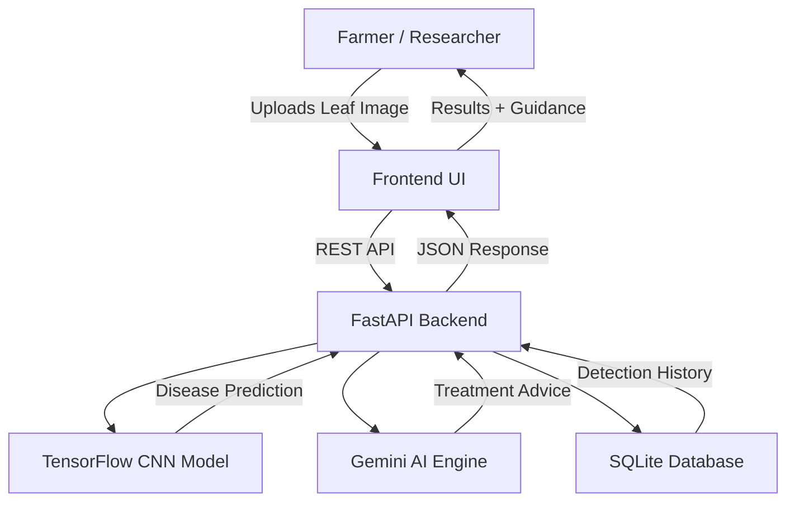

# 🍃 LeafSense-AI: Intelligent Plant Disease Diagnostic System
[](https://fastapi.tiangolo.com/)
[](https://tensorflow.org/)
[](https://ai.google.dev/)
[](LICENSE)

A production-ready **AI-powered agricultural intelligence platform** that helps farmers and researchers instantly detect plant diseases, receive multilingual treatment guidance, and track crop health history using deep learning and generative AI.

This system combines **TensorFlow CNN-based disease detection**, **Gemini-powered farming intelligence**, and **FastAPI backend services** into a scalable full-stack smart agriculture workflow.

---

## ✨ Features

- **🔍 Deep Learning Disease Detection**
  - High-confidence CNN prediction pipeline
  - PlantVillage-style crop disease recognition
  - 224x224 RGB preprocessing workflow
  - Confidence score based classification

- **💬 Gemini Multilingual Farming Assistant**
  - Context-aware crop treatment suggestions
  - Prevention + pesticide recommendations
  - Human-like multilingual advisory
  - 12-language support for Indian farmers

- **🗂️ Persistent Detection History**
  - User-wise plant scan history
  - SQLite logging for disease records
  - Longitudinal crop health monitoring

- **🌦️ Smart Seasonal Crop Guidance**
  - Crop-specific seasonal best practices
  - Farming advisory workflows
  - Ready for weather API integration

- **🔐 Secure Authentication**
  - SHA-256 password hashing
  - Persistent login sessions
  - Frontend localStorage state retention

---

## 🏗️ Full Architecture



### Folder Structure
```text
LeafSense-AI/
│
├── api.py                     # FastAPI backend routes
├── config.py                  # Environment + Gemini config
├── database.py                # SQLite DB manager
├── class_indices.json         # Disease class mapping
├── requirements_simple.txt    # Dependencies
├── README.md                  # Project documentation
├── LICENSE                    # MIT License
│
├── frontend/
│   ├── index.html
│   ├── app.js
│   └── style.css
│
├── assets/
│   └── system-architecture.png
│
└── data/
    └── plant_disease.db
```

---

## 🚀 Setting it up Locally

### 1. Clone & install
```bash
git clone <your-repo>
cd LeafSense-AI
pip install -r requirements_simple.txt
```

### 2. Create virtual environment
```bash
python -m venv venv
venv\Scripts\activate
```

### 3. Configure Gemini API
Add this inside `config.py`:

```python
GEMINI_API_KEY = "YOUR_API_KEY_HERE"
```

### 4. Run backend
```bash
python api.py
```

### 5. Open frontend
```text
frontend/index.html
```

---

## 📦 Project File Distribution

To keep the GitHub repository lightweight and recruiter-friendly, the project is split between **GitHub source code** and **Google Drive ML assets**.

### 📁 Available on GitHub
- Backend source code
- FastAPI routes
- Frontend UI
- SQLite database logic
- JSON class mappings
- README + LICENSE
- System architecture image

### ☁️ Available on Google Drive
Large ML resources:
- `best_model.h5`
- backup/final trained models
- `Data.zip`
- additional dataset resources

📥 **Google Drive Folder**  
https://drive.google.com/drive/folders/19uvSl6XpTajdxCkH6iZz9ht3GNCE_Fe7?usp=drive_link

---

## 🕹️ API Endpoints

| Method | Endpoint | Description |
|---|---|---|
| POST | `/api/auth/register` | Register user |
| POST | `/api/auth/login` | Login |
| POST | `/api/predict` | Predict plant disease |
| GET | `/api/detections/{id}` | Detection history |
| POST | `/api/chat` | Gemini farming chatbot |
| POST | `/api/guidance` | Crop seasonal guidance |

---

## 🎯 Real-World Use Cases
- Farmer-side instant leaf disease diagnosis
- Agricultural research crop monitoring
- Historical disease analytics
- Multilingual rural farmer support
- AI-driven smart farming advisory
- Precision agriculture workflows

---

## 🛣️ Future Roadmap
- [ ] Android app for farmers
- [ ] Offline TensorFlow Lite prediction
- [ ] Live weather API crop guidance
- [ ] Disease severity percentage estimation
- [ ] Voice chatbot in regional languages
- [ ] Fertilizer + pesticide recommendation engine
- [ ] Crop yield prediction module
- [ ] Drone field disease scanning
- [ ] Farmer community collaboration dashboard

---

## 📄 License
MIT License. Free to use, fork, modify, and distribute.

---

## 👨‍💻 Author
**Tarun Chahal**  
AI | ML | FastAPI | Agricultural Intelligence Systems

Built with ❤️ for smarter agriculture and real farmer impact 🌱
